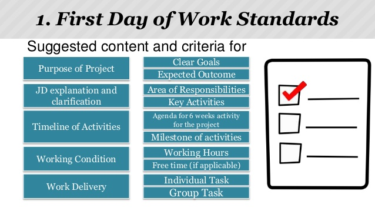
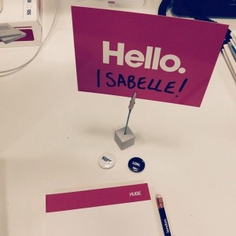
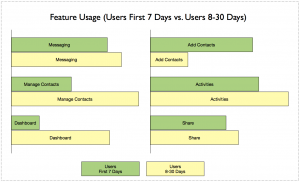
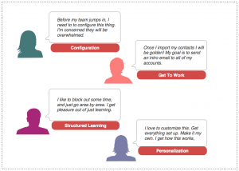
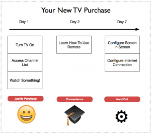
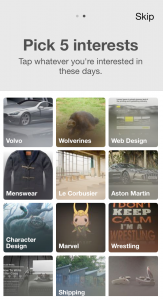
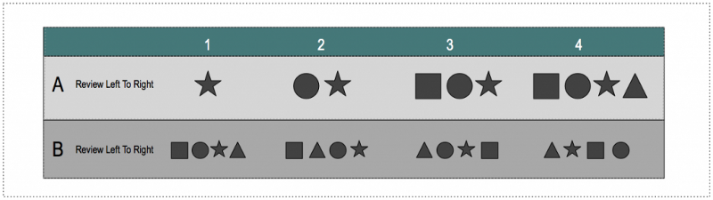
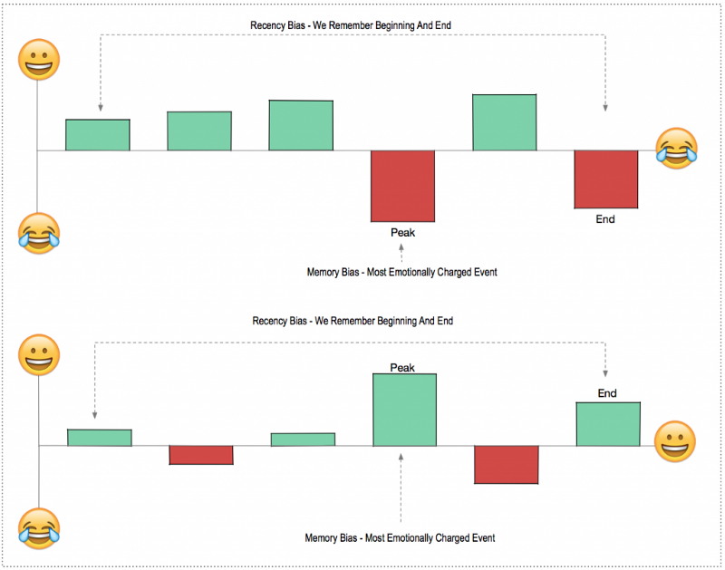
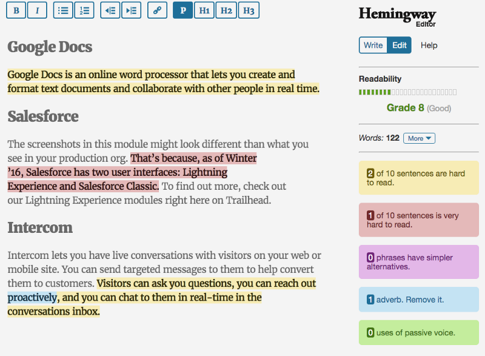
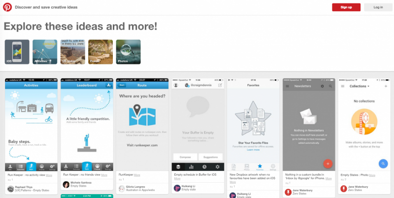

### What is progressive disclosure?

_Progressive disclosure defers advanced or rarely used features to a secondary screen, making applications easier to learn and less error-prone (_[_Jakob Nielsen_](https://www.nngroup.com/articles/progressive-disclosure/)_)._

In the context of software product onboarding, it refers to disclosing features/navigation/and options as the user advances through the onboarding process. Your brain and its ability to remember information, play an important role in how well you process data through onboarding.

For a non-software example, consider the first day of a new job . . .

Have you ever arrived at a new job only to get thrown into three back-to-back meetings, reams of paperwork, setting up ADP, and struggling trying to get your computer working? Too much!

Check out this inspiration.

Now compare that to a relaxed employee onboarding. You’re shown your desk and meet your co-workers informally. Someone hands you a computer with your temp credentials, you log in, and everything is pre-configured. HR introduces minimal paperwork and sends out an awesome welcome email (score!). You attend a half hour welcome meeting. And then have the afternoon free to get your desk set up.

Compare those two experiences. The former is like the spray-and-pray onboarding experiences popular in many B2B SaaS apps. Someone has decided that unless you get to point 20 (and don’t skip 1–19) you’ll churn, so the app plays task-master. The latter encourages focus, relaxation, and memorable moments. One maximizes for the short term business goals, and the other maximizes for long-term employee retention.

Below we’ve included 10 tips and info tidbits centered around progressive disclosure.

### 1\. User First (Biz Second)

Differentiate your business goals from your user goals. It can be tempting to structure your onboarding experience based on business goals (e.g. “once they do X we can start charging them, so we should guide them to do X”). This might overwhelm the user, and undermine your goal in the long run.

### 2\. Analyze the “Now”

Track the behavior of new-user cohorts to understand feature usage patterns. How do the users you retain behave in the app during their first 1–3 days? Typically these users will focus on a very small cross-section of the functionality. Consider highlighting these key features in your onboarding experience, and minimize all other distractions. Whenever possible use path analysis to understand the journey. Aggregate feature usage can be misleading.

How do users behave in their first 7 days in your product? Compare usage against another cohort.

### 3\. Segmentation

Not all users are alike. Do your smaller customers have unique needs? Do your larger customers have learning requirements? Segmenting on customer size, tenure, products purchased, and role allows you to be economical and non-disruptive with your content.

### 4\. Test, Baseline, and Iterate

Prior to implementing an onboarding experience, be sure to conduct usability tests with new users. Where do new users struggle? What are they eager to try first? And when do they express a heightened level of satisfaction (“oh, that was_cool_”)? Use these tests to establish [a usability benchmark](http://www.usability.gov/how-to-and-tools/methods/system-usability-scale.html) and retest any new onboarding experiences. Onboarding is rarely a plug-and-play experience.

Users are simply unpredictable. It will work exactly like your detailed journey maps. Check out this video of [people using an electronic pen for the first time](https://www.youtube.com/watch?v=eIxZFvf4s6s).

### 5\. Less Reading & More Visuals

Users read a lot less than you think ([~20%](https://www.nngroup.com/articles/how-little-do-users-read/)). People don’t have great short-term memories. We can remember [7 +/-2 things at once, for up to 30 seconds](http://www.musanim.com/miller1956/). Reduce copy and use visuals whenever possible (visual recall is much stronger).

These visuals make choosing a Pinterest board much easier.

### 6\. Minimize

Finishing stuff is hard. The number of steps, length of steps, difficulty of steps, the number of choices, the amount of thought, and general confusion all impact the likelihood of a user completing a task. Seek to minimize these whenever possible.

Read row A below left to right. Now read row B.

What went through your head? How did that feel? Most people feel significantly more strained when reading Row B.

### 7\. Highpoints & Grand Finales

However, don’t cram content into single steps and believe that your conversation rate will be higher! Consider the [Peak-End Rule](https://en.wikipedia.org/wiki/Peak%E2%80%93end_rule). People judge an experience by the most intense point of an experience and its end — not all the stops in between. It is tempting to imagine that every step will convey value, or think that aggressively limiting steps will do the same. Instead, focus on a “peak experience” — a major payoff in the app — and then finishing with a positive experience (“well done”!). Users will remember the experience more positively if they end on a positive note.

The Peak-End Rule is a bias superpower, combining the Recency Bias and the Memory Bias:

### 8\. Progressive Content

Don’t assume that users know the language of your application! Avoid overwhelming the user with app lexicon. Those are your words, not theirs (yet). Start with basic instructions (“try this”) and then progressively introduce more advanced terms. Check out [Copywriting for UX](https://medium.com/@talisa/copywriting-for-ux-1c577924698a#.jmbl941d6) by Talisa Chang for some great tips.

If you are feeling like a good beatdown, [check out Hemingway App](http://www.hemingwayapp.com/).

### 9\. Blank Slate

Tackle the “[blank slate](https://gettingreal.37signals.com/ch09_The_Blank_Slate.php)” problem. Without data and content, learning an application is difficult. Nudge the user to create data and content quickly. This will make future onboarding efforts more valuable. Don’t disclose these features until data exists to use them!

### 10\. Measure & Learn

Carefully monitor your onboarding analytics. Where do users abandon? Do they start and stop? At Pendo we encourage customers to use our Sample Group feature to run A/B tests and/or slowly ramp up their onboarding experience. Changes can be made without engineering assistance, so there’s no excuse for shabby, untested work.

Onboarding is more than simply convincing users to stick with your application’s steps. Onboarding is about the experience — within your company, your team, or your application. Good onboarding will make you feel welcome, and give you positive feedback so you can return again and again to get those warm fuzzy endorphins. A good onboarding experience gains you an employee or a customer. A great onboarding experience gains you a champion.
