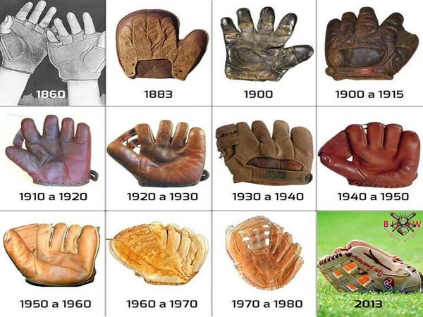

Note: 

I was pondering the words “fitness” and “maturity” today, and my mind drifted to sports, athletes, and training. 

With the Capability Maturity Model (CMM):

> …the term “maturity” relates to the degree of **formality and optimization of processes**, from [_ad hoc_](https://en.wikipedia.org/wiki/Ad_hoc "Ad hoc") practices, to formally defined steps, to managed result metrics, to active optimization of the processes. ([Wikipedia](https://en.wikipedia.org/wiki/Capability_Maturity_Model))

The challenge I have with this definition is that a company can optimize processes for one challenge (and have a high degree of _formality_), but be incapable of adapting to a new challenge.

  

---

**Specificity:** Athletes train differently depending on their goal event. A mountaineer may spend _some_ time in the pool, and an Olympic swimmer may spend _some_ time hiking…but they tend to train differently (focus on different muscle groups, energy systems, etc.)

Some sports involve very specific skills (e.g. curling, archery) while other sports are far more _general_ (e.g. running). Athletes may choose to specialize as well. In cycling, an all-rounder —knows as a rouleur — might have a shot of winning all but the hilliest and flattest races. Whereas a “pure climber” will only win races featuring a long, final climb (and they’ll be far skinnier).

The bodies look different…a sumo wrestler isn’t going to win a marathon.

](./asset-1.png)

**Foundational Skills**: Some skills transcend _all_ sports: diet, smart recovery, risk management, building a support structure, growth mindset, focus, etc.

**Event oriented**: Fitness is viewed in relationship to an event. Junior athletes typically race shorter distances, and compete against athletes of a similar age. They have high fitness relative to the event, but cannot reach elite performance levels (yet). 

**Sports evolve**: Sports don’t remain the same. Basketball looks very different today, than it did fifty years ago. Strategies emerge. Innovation happens. You have innovations in the equipment and training techniques used. Recently in cycling there has been a lot of hype around “marginal gains”. Marginal gains looks for multiple new/novel/small improvements, and combines these tweaks for a large cumulative effect.

**Rate of evolution**: In certain sports (extreme sports is a great example) you see massive performance improvements. Twelve year olds can land the same jumps that pros were landing just a couple years earlier. These sports are in their infancy, and the rate of innovation is blinding. 

**Detraining**: Most athletes are not at the top of their game for the whole season. They “detrain” in the offseason and lose fitness, and also target specific events for peak performance. You can’t be at the top of your game 365 days a year.

**Career**: In many sports, athletic development can take decades. Your mind and body is changing in fundamental ways. Some athletes hit their prime in their teens. Other athletes hit their groove in their 30s. 

**Allocate resources**: An athlete must always consider how they spend their time, and energy. You have to be extremely conscious of that investment. Time and energy are in limited supply, and can be slow to replenish. There are only so many hours in a day. And your body can only process/hold so many calories.

**Feedback**: An athlete needs feedback to guide their training to understand if your program is on track. Shortening the feedback loop is important, otherwise you can stray far afield.

**Maturity**: We’ve all heard of college athletes who are considered “mature for their age”. This may have to do with physical characteristics, but most often they’re talking about their mindset, attitude, discipline, knowledge of the game, demeanor, professionalism, etc.

**Winers and losers**: Sports have winners and losers. Sometimes the “better” team loses

**Support systems**: Athletes have coaches, trainers, and managers. It can be difficult to self-coach and review your training progress objectively. Sometimes you need a trainer to walk you through exercises, help prevent injury, and keep your body flexible. Sometimes you need a manager to run your business affairs. 

**Performance**: Fitness doesn’t guarantee performance. If the pieces (strategy, recovery, etc.) don’t “fall into place”, you can be fit but lose the game.
