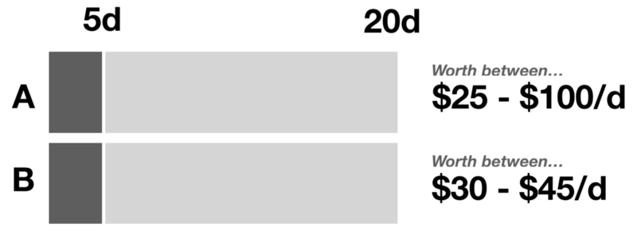

  

You have to decide between two bets. You estimate both will take between 5 and 20 days to “play” (say we’re 90% confident it will take between 5 and 20 days). You estimate **Item A** has a shot of earning you between $25 and $100 a day (again, 90% confidence interval). **Item B** has a shot of earning between $30 and $45 a day. Which do you pick?

Ignoring the question of how the data is distributed (very, very important question…apologies for the oversimplification), I think it is pretty obvious we’d go with **Item A**. The low end is slightly lower, but the best case scenario is significantly higher ($100/d vs. $25/d).
